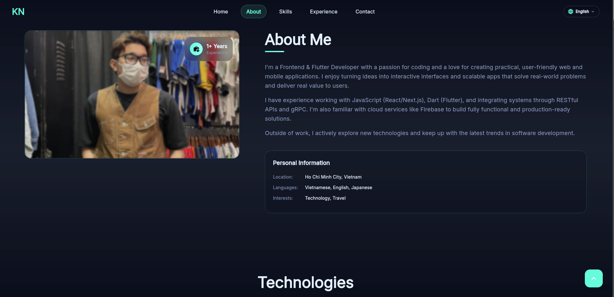
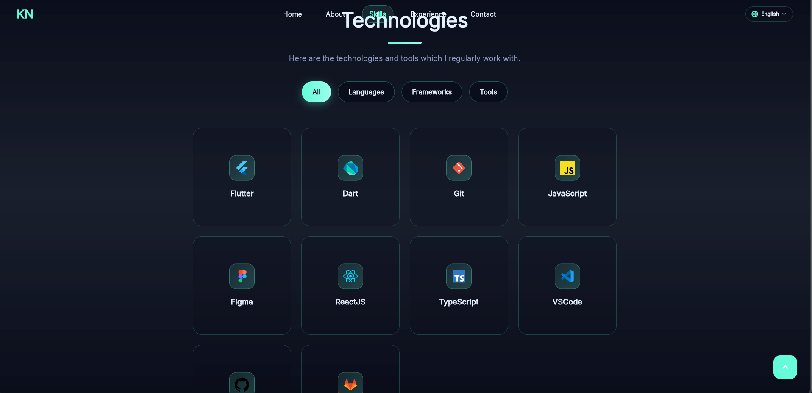
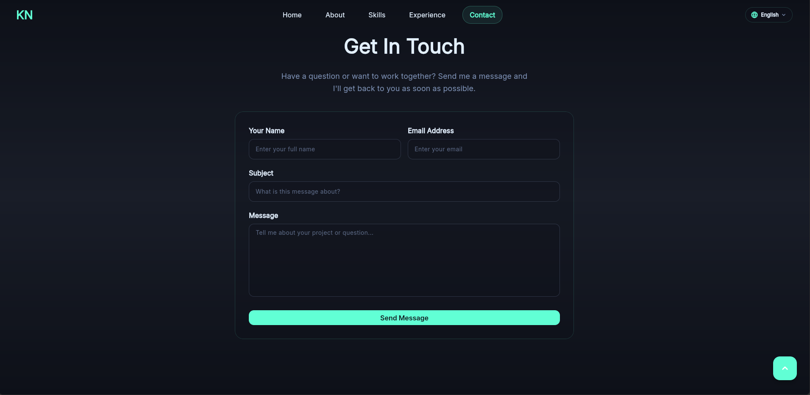

# Kiet Nguyen - Portfolio


**Live Preview: 👉🏽 [kietnguyen](https://mido2610.github.io/kiet_portfolio/)**

✨ Hello there, I'm Kiet Nguyen. This is my personal portfolio website showcasing my work as a Flutter Developer, built with modern technologies and best practices.

## 🎬 Captured Moment

<div align="center">

### 🌟 Portfolio Showcase


<details>
<summary>📸 View More Screenshots</summary>

### About Me


### Skills


### Experience


### Contact Form


</details>

*Click above to explore all sections of the portfolio*

</div>
## 🍃 Branches

Source Code

- [main](https://github.com/mido2610/kiet_portfolio/tree/main) - Stable and latest version of the source code
- [develop](https://github.com/mido2610/kiet_portfolio/tree/develop) - Development and feature branches

Web Build

- [gh-pages](https://github.com/mido2610/kiet_portfolio/tree/gh-pages) - Stable and latest version of the web build

## 💙 Built With

- **[Flutter](https://flutter.dev) 3.29.2**
  - Framework • revision c236373904
  - Tools • Dart 3.7.2 • DevTools 2.42.3
  - Engine • revision 18b71d647a
- **[GitHub Pages](https://pages.github.com)** - Hosting
- **[EmailJS](https://www.emailjs.com)** - Contact form functionality

## 🏗️ Architecture & State Management

- **[Riverpod](https://riverpod.dev)** - State management solution
- **[Flutter Hooks](https://pub.dev/packages/flutter_hooks)** - React-like hooks for Flutter
- **[Hooks Riverpod](https://pub.dev/packages/hooks_riverpod)** - Integration between Riverpod and Flutter Hooks
- **[Freezed](https://pub.dev/packages/freezed)** - Code generation for data classes
- **[JSON Annotation](https://pub.dev/packages/json_annotation)** - JSON serialization

## 🎨 UI & Design

- **[Google Fonts](https://pub.dev/packages/google_fonts)** - Custom typography (Inter font family)
- **[Flutter SVG](https://pub.dev/packages/flutter_svg)** - SVG rendering
- **[Lottie](https://pub.dev/packages/lottie)** - Advanced animations
- **[Animated Text Kit](https://pub.dev/packages/animated_text_kit)** - Text animations
- **[Flutter Animate](https://pub.dev/packages/flutter_animate)** - Animation framework
- **[Flutter Staggered Animations](https://pub.dev/packages/flutter_staggered_animations)** - Staggered list animations

## 📱 Responsive Design

- **[Responsive Framework](https://pub.dev/packages/responsive_framework)** - Multi-screen responsive design
- **Custom responsive utilities** - Breakpoint management
- **Mobile-first approach** - Optimized for all devices

## 🌍 Internationalization

- **[Flutter Localizations](https://flutter.dev/docs/development/accessibility-and-localization/internationalization)** - i18n support
- **[Intl](https://pub.dev/packages/intl)** - Internationalization utilities
- **Multi-language support** - English & Vietnamese

## 🧭 Navigation & Routing

- **[Go Router](https://pub.dev/packages/go_router)** - Declarative routing
- **[Scroll To Index](https://pub.dev/packages/scroll_to_index)** - Smooth section navigation
- **[Visibility Detector](https://pub.dev/packages/visibility_detector)** - Viewport detection

## 🔗 Integrations

- **[EmailJS](https://pub.dev/packages/emailjs)** - Direct email sending from contact form
- **[URL Launcher](https://pub.dev/packages/url_launcher)** - External link handling
- **[Shared Preferences](https://pub.dev/packages/shared_preferences)** - Local storage
- **[Connectivity Plus](https://pub.dev/packages/connectivity_plus)** - Network status monitoring

## 📌 Prerequisites

- **Flutter SDK**: `>=3.7.2 <4.0.0`
- **Dart SDK**: `>=3.7.2 <4.0.0`
- Code editor: [Android Studio](https://developer.android.com/studio), [VS Code](https://code.visualstudio.com), or [IntelliJ IDEA](https://www.jetbrains.com/idea/)
- [Git](https://git-scm.com) version control
- Web browser for testing (Chrome recommended)
- Should pass `flutter doctor` command

## 💡 How to Setup

```bash
# Clone the repository
git clone https://github.com/mido2610/kiet_portfolio.git

# Navigate to project directory
cd kiet_portfolio

# Get dependencies
flutter pub get

# Generate code (for Freezed, JSON serialization)
dart run build_runner build --delete-conflicting-outputs  

# Generate localization files
flutter gen-l10n

# Clean build (if needed)
flutter clean && flutter pub get
```

**⚠️ Important**: Do not update Flutter/Dart versions until the app runs successfully with current versions.

## 🚀 How to Run

### Development
```bash
# Run on Chrome (recommended for development)
flutter run -d chrome

# Run on specific device
flutter devices
flutter run -d [device-id]

# Run with hot reload
flutter run --hot
```

### Production Build
```bash
# Build for web
flutter build web --release

# Build with custom base href (for GitHub Pages)
flutter build web --release --base-href /kiet_portfolio/

# Serve locally
cd build/web
python -m http.server 8000
# Open http://localhost:8000
```

## 📧 EmailJS Setup

To enable contact form functionality:

1. Follow the detailed guide in `EMAILJS_SETUP.md`
2. Create EmailJS account at [emailjs.com](https://www.emailjs.com)
3. Configure email service and template
4. Update API keys in `lib/core/services/email_service.dart`

## 🖼️ Assets & Resources

- **Icons**: Custom SVG icons in `assets/icons/`
- **Fonts**: Inter font family (Light, Regular, Bold, Black)
- **Images**: Portfolio images in `assets/images/`
- **Animations**: Lottie files in `assets/animations/`

## 💎 Key Dependencies

### Production Dependencies
| Package | Version | Purpose |
|---------|---------|---------|
| flutter_hooks | ^0.21.2 | React-like hooks |
| riverpod | ^2.6.1 | State management |
| hooks_riverpod | ^2.6.1 | Hooks + Riverpod integration |
| google_fonts | ^6.2.1 | Typography |
| flutter_animate | ^4.5.2 | Animations |
| responsive_framework | ^1.5.1 | Responsive design |
| go_router | ^15.2.0 | Navigation |
| emailjs | ^4.0.0 | Email functionality |

### Development Dependencies
| Package | Version | Purpose |
|---------|---------|---------|
| build_runner | ^2.4.7 | Code generation |
| freezed | ^2.4.6 | Data classes |
| json_serializable | ^6.7.1 | JSON serialization |
| flutter_lints | ^5.0.0 | Code quality |

## 🌟 Features

- ✅ **Responsive Design** - Works on all devices
- ✅ **Smooth Animations** - Professional animations
- ✅ **Contact Form** - Direct email integration
- ✅ **Multi-language** - English & Vietnamese
- ✅ **Fast Performance** - Optimized for web
- ✅ **Modern Architecture** - Clean code with best practices

## 💙 Contributing

If you find any issues or would like to suggest improvements:

1. Fork the repository
2. Create a feature branch (`git checkout -b feature/amazing-feature`)
3. Commit your changes (`git commit -m 'Add amazing feature'`)
4. Push to the branch (`git push origin feature/amazing-feature`)
5. Open a Pull Request

Please follow the existing code style and conventions.

## ❤️ Thanks

Thanks to everyone who supported this project and the amazing Flutter community.

## 👨‍💻 Developed By

**Kiet Nguyen**  
Flutter Developer

[](https://github.com/Mido2610)
[](https://www.linkedin.com/in/nguyen-kiet-886554299/)
[](mailto:ngtuankiet2610@gmail.com)

## 💬 Contact

Feel free to reach out for collaboration, questions, or just to say hi!

**Email**: [ngtuankiet2610@gmail.com](mailto:ngtuankiet2610@gmail.com)  
**GitHub**: [@mido2610](https://github.com/Mido2610)

---

⭐ **Star this repository if you found it helpful!**
